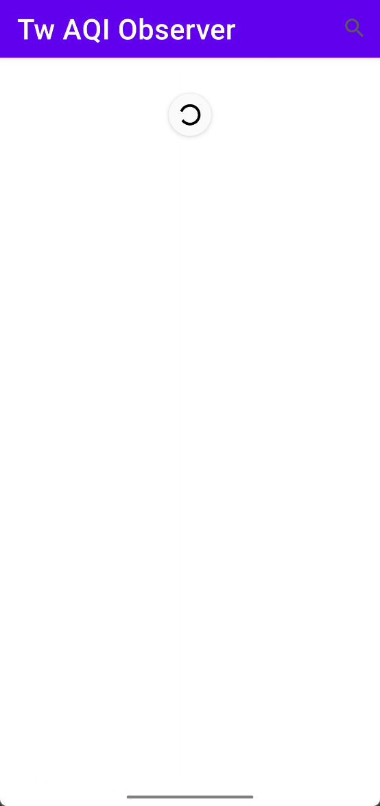
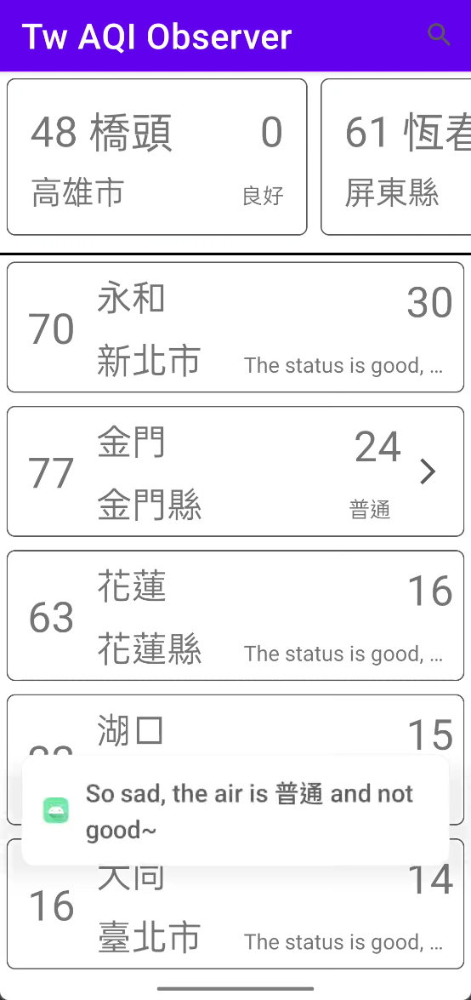
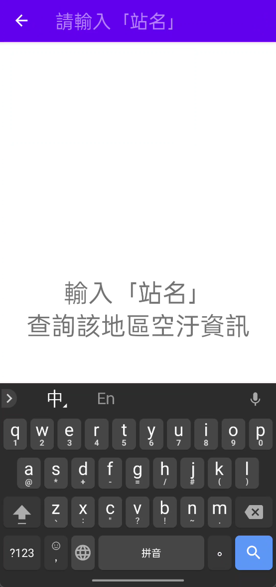
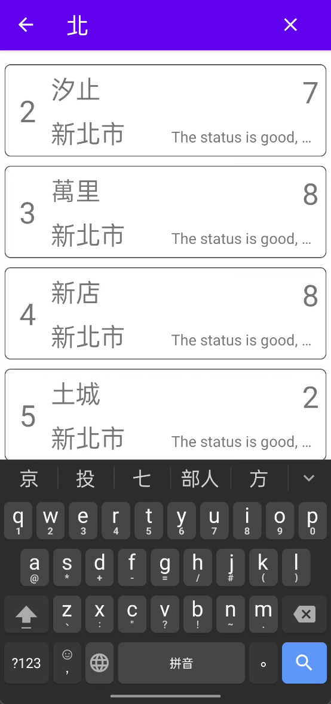
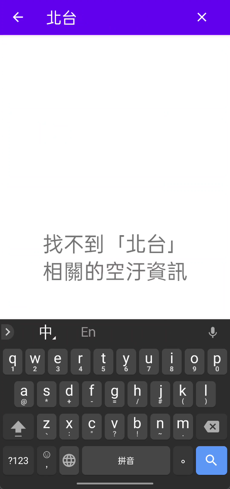
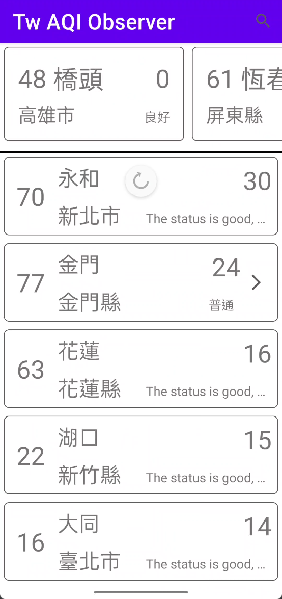

# Taiwan AQI Observer

https://data.gov.tw/dataset/40448

## DONE

* OkHttp REST API to get data
* Json data class & parse
* RecycleView Adapter to display json data
  * 共用 AqiAdapter 顯示 Vertical / Horizontal RecyclerView (使用不同 ItemView Layout)
  * 實作 filter 作為 SearchView FilterAdapter (sitename || county)
* 計算 PM2.5 中位數作為 Threshold
  * 上半部水平 RecyclerView (PM 2.5 <= threshold)
  * 下半部垂直 RecyclerView (PM 2.5 > threshold)
* 加入 SwipeRefreshLayout - swipe to refresh 功能

## Reference

* https://json2kt.com/
* RecyclerView https://ithelp.ithome.com.tw/articles/10238539
* RecyclerView https://ithelp.ithome.com.tw/articles/10187869
* okhttp Timeout 超时设置与用法解释 https://www.jianshu.com/p/7547a5e8524a
